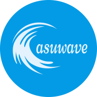

# 上位机 · 网页版 · 重制版

   

[Demo](https://asuwave.herokuapp.com/)  

>~~你所用过坠好的上位机~~  
>~~简洁、优雅且好用~~  
>每日一问，今日进度如何



## 佛系·上位机

君问何项最佛系，当属网页上位机。  
先由杨编做设计，后有玮文提建议。  
退队人员再召集，分工明确尽全力。  
年末网管协议拟，初有成效心欢喜。  
世事难料众人离，一昧孤行无所依。  
来年再把项目启，当年锐气远不及。  
半途而废人言弃，奈何图表帧数低。  
次年又把决心立，志在月底创佳绩。  
后端进展颇顺利，前端不见人踪迹。  
五月将至无人理，项目组员心已急。  
两日奋战舞士气，何时完成仍成谜。  
回首往事泪满地，此事羞与后人提。  

## 使用教程

### 单片机端代码准备

复制`asuwave.c`和`asuwave.h`到你的工程

#### 串口配置

就是cubeMx的默认配置

#### 上位机初始化函数

```c
/*
 *	@brief 	上位机初始化配置函数
 *	@param	huart	串口句柄指针
 *	@param	f		获取系统时刻(ms级)函数指针，可以是FreeRTOS的xTaskGetTickCount
 * 	@retval	None
 */
void asuwave_init(UART_HandleTypeDef *huart, uint32_t (*f)(void));
```

示例：

```c
asuwave_init(&huart1, xTaskGetTickCount);
```

#### 串口接收处理函数

```c
/**
 * @brief  asuwave callback.
 * @param  data_buf: received buffer array.
 * @param  length: the length of array.
 * @retval None
 */
uint32_t asuwave_callback(uint8_t *data_buf, uint16_t length)
```

串口接收到后将存储接收数据的数组和接收数据的长度传给该函数处理

#### 周期处理数据任务

```c
/**
 * @brief  Subscribes the variable in flash memory of the given address.
 * @param  None
 * @retval None
 */
void asuwave_subscribe(void)
```

示例

```c
/**
  * @brief  debug task
  */
void tskAsuwave(void *arg)
{
  /* Cache for Task */

  /* Pre-Load for task */
  TickType_t xLastWakeTime_t;
  xLastWakeTime_t = xTaskGetTickCount();

  /* Infinite loop */
  for (;;)
  {
    /* Wait for the next cycle */
    vTaskDelayUntil(&xLastWakeTime_t, 10);

    asuwave_subscribe();
  }
}
```

### 电脑端使用指南

打开`asuwave_windows_amd64.exe`软件

然后在浏览器输入地址`http://localhost:8000/`

打开后的界面：


变量选择界面


目前上位机可以修改的变量数量上限是所有全局变量的数量，观察的变量数量上限是10.

切记不要在关闭串口后删除变量，这个问题已经提交到github仓库的Issue了，**如果大家在使用的过程中发现这款上位机没能满足你的一些需求或者你发现了bug，欢迎你到github仓库提交问题**

### 如何DEBUG

如果你发现在观察变量列表上有变量但没有曲线，进入debug，将`asuwave.c`文件中的一个结构体变量`list_addr`加入观察，看看里面是否有对应变量的地址。

```c
typedef struct
{
  uint8_t dataNum;
  uint32_t addr;
} list_addr_t;
static list_addr_t list_addr[MAX_ADDR_NUM];
```

其他的一些情况可以刷新以下网页看看。